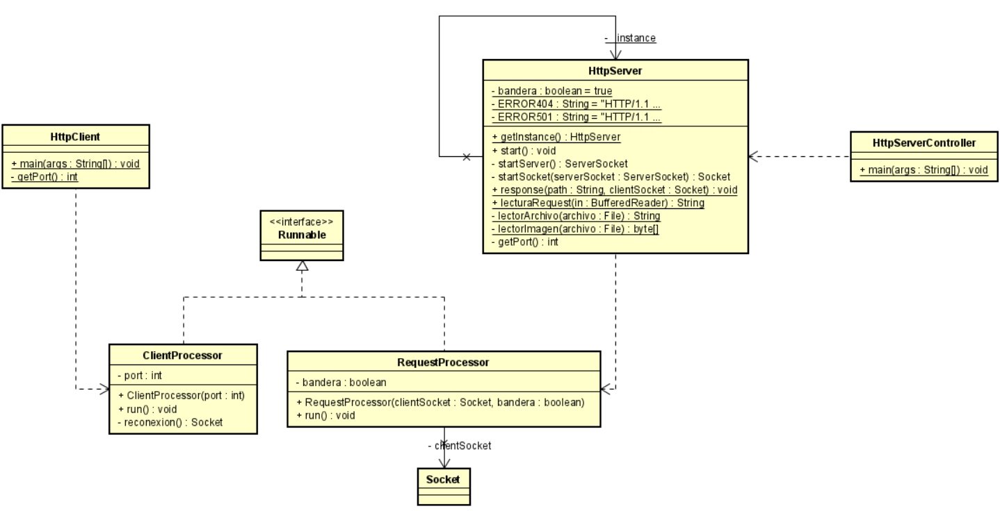

# Titulo

Networking

## Descripción

En este repositorio se encontrara un programa que crea un servidor web, permitiendo multiples solicitudes seguidas concurrentes.

Para ver la implementación en Heroku dirijase [aquí](https://servidorweb-arsw.herokuapp.com/resources/index.html)

### LOC/h

Para este taller se hicieron 479 líneas de código, en 9 horas.

**53.2 LOC/h**

### Prerrequisitos

Para correr este se debe tener instalado:

- Maven
- Java

### Guía de uso

Para compilar el proyecto se debe usar:

```
mvn package
```

Para ejecutarlo, se debe hacer de la siguiente forma

```
$ java -cp "target\classes" edu.escuelaing.co.app.HttpServerController
```

Una vez ejecute este comando podrá ingresar al servidor web desde su navegador con la siguiente ruta http://localhost:35000/resources/index.html, en esta encontrará una página html con un script en JavaScript y 2 imagenes, una jpeg y otra gif.

Si desea visualizar cualquiera de estos por separado debe indicar la ruta completa donde se encuentran estos recursos.

En caso de que desee insertar un recurso propio, lo puede hacer, se recomienda hacerlo en la carpeta resources para mantener su orden respectivo.

En caso de querer probar la concurrencia mencionada debe ejecutar el siguiente código:

```
$ java -cp "target\classes" edu.escuelaing.co.app.HttpClient [Número de peticiones a realizar]
```

En ambos casos se tiene una limitación a 10 hilos, luego de cumplir estos, se esperará en una cola a que pueda seguir la petición, debido a esto se recomienda no hacer una cantidad desmedida de peticiones puesto que puede llegar a demorarse bastante en dar respuesta a todas estas.

## Documentación

Para visualizar la documentación se debe ejecutar el siguiente comando:

```
mvn javadoc:javadoc
```

Una vez se realice este comando, se debe buscar en la siguiente ruta "target\site\apidocs\index.html"

## Estructura de Archivos

    .
    |____pom.xml
    |____src
    | |____main
    | | |____java
    | | | |____edu
    | | | | |____escuelaing
    | | | | | |____co
    | | | | | | |____app
    | | | | | | | |____HttpServerController.java
    | | | | | | | |____HttpServer.java
    | | | | | | | |____RequestProcessor.java
    | | | | | | | |____ClientProcessor.java
    | | | | | | | |____HttpClient.java
    | | | | | | | |____explicacion
    | | | | | | | | |____EchoClient.java
    | | | | | | | | |____EchoServer.java
    | | | | | | | | |____MathClient.java
    | | | | | | | | |____MathServer.java
    | | | | | | | | |____URLExplorer.java
    | | | | | | | | |____URLReader.java
    | |____test
    | | |____java
    | | | |____edu
    | | | | |____escuelaing
    | | | | | |____co
    | | | | | | |____app

## Diagrama de Clases



## Construido con

- [Maven](https://maven.apache.org/) - Dependency Management
- [Java](https://www.java.com/es/) - Progamming Language

## Autor

- **Juan Carlos Baez Lizarazo** - [juanbaezl](https://github.com/juanbaezl)

## Fecha

15 de Junio, 2022

## Licencia

Para más información ver: [LICENSE.txt](License.txt)
